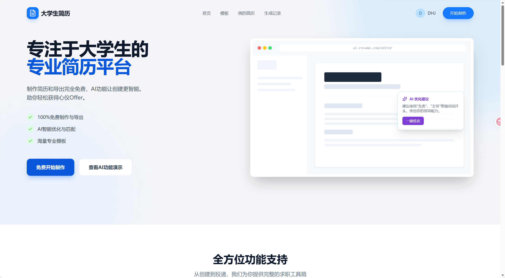

# AI Resume - 大学生智能简历生成系统

基于 Vue 3 + TypeScript 的 AI 驱动简历生成平台，支持智能内容生成、多模板切换、实时预览与 PDF 导出。

---

## 在线体验

> **[立即免费使用](http://115.159.4.70/home)**
> 无需注册，打开即用

---

## 功能特性

### AI 智能辅助

- **AI 一键生成** — 输入岗位和基本信息，AI 自动生成工作经历、项目描述、自我评价等完整内容
- **AI 内容润色** — 一键润色已有内容，把普通描述改写成更有吸引力的表达
- **AI 简历分析** — 多维度评估简历质量，生成雷达图评分报告，给出针对性优化建议

### 强大的编辑器

- **可视化拖拽排序** — 模块间、模块内条目均支持拖拽排序，个性化布局一步到位
- **11 个内容模块** — 基本信息、求职意向、教育背景、工作经历、项目经历、校园经历、实习经历、技能特长、证书荣誉、自我评价
- **富文本编辑** — 支持加粗、列表、链接等格式（WangEditor）
- **实时预览** — 左编辑右预览，所见即所得
- **全局样式设置** — 自定义字体、间距、配色等样式细节

### 模板市场

| 模板 | 特点                          |
| ---- | ----------------------------- |
| 默认 | 简洁大方，适合大多数岗位      |
| 双栏 | 信息密度高，适合经验丰富者    |
| 简约 | 清晰利落，适合互联网/设计岗位 |
| 优雅 | 精致排版，突出专业感          |
| 轻奢 | 高端质感，适合资深求职者      |
| 极简 | 大量留白，突出核心信息        |
| 现代 | 潮流配色，适合创意类岗位      |

支持在线浏览模板市场，一键创建简历。

### 导出与分享

- **PDF 导出** — 自定义分页算法，完美还原排版，支持 A4 分页
- **多份简历管理** — 一个账号管理多份简历，针对不同岗位灵活切换
- **AI 生成记录** — 查看历史 AI 生成内容，方便回溯与复用

### 用户系统

- **账号注册 / 登录** — 支持邮箱注册及 GitHub、Gitee 第三方 OAuth 登录
- **个人中心** — 管理我的简历、查看 AI 生成记录

---

## 截图预览

> 

---

## 快速开始

### 环境要求

- Node.js >= 18
- pnpm >= 8
- 后端服务：[ai-resume-server](https://github.com/dhj-l/ai-resume-server)（NestJS + MongoDB）

### 安装运行

```bash
# 克隆项目
git clone https://github.com/dhj-l/resume.git
cd resume/ai-resume

# 安装依赖
pnpm install

# 配置环境变量
cp .env.example .env
# 编辑 .env，填入后端地址

# 启动开发服务器
pnpm dev
```

打开浏览器访问 http://localhost:5173

### 常用命令

```bash
pnpm build          # 类型检查 + 生产构建
pnpm preview        # 预览生产构建
pnpm lint           # ESLint 检查 + 自动修复
pnpm format         # Prettier 格式化
pnpm test:e2e       # Playwright E2E 测试
pnpm test:e2e:ui    # Playwright UI 模式
```

---

## 技术栈

| 类别     | 技术                                                                      |
| -------- | ------------------------------------------------------------------------- |
| 框架     | Vue 3.5 + TypeScript 5.9 + Vite 7                                         |
| 状态管理 | Pinia 3（持久化）                                                         |
| UI 组件  | Ant Design Vue 4 + Lucide Icons                                           |
| 富文本   | WangEditor 5                                                              |
| 样式     | Tailwind CSS 3.4 + SASS                                                   |
| HTTP     | Axios                                                                     |
| 图表     | ECharts + vue-echarts                                                     |
| 动画     | GSAP                                                                      |
| 导出     | html2canvas + 自定义分页算法                                              |
| 安全     | DOMPurify（XSS 防护，v-safe-html 指令）                                   |
| 工具库   | Day.js + @vueuse/core                                                     |
| 测试     | Playwright（E2E）                                                         |
| 代码规范 | ESLint 9 + Prettier                                                       |
| 后端     | NestJS + MongoDB（[独立仓库](https://github.com/dhj-l/ai-resume-server)） |

---

## 项目结构

```
src/
├── api/            # 接口定义（auth / resume / resume-ai / template / upload / user）
├── components/     # 公共组件
│   ├── ai-polish-button/    # AI 润色按钮
│   ├── basic-editor/        # 富文本编辑器封装
│   ├── common/              # 通用组件（按钮、加载、过渡动画等）
│   ├── home/                # 首页组件（Hero、功能展示、模板画廊、数据信任）
│   ├── layout/              # 布局组件（导航栏、页脚）
│   └── resume-analysis/     # AI 简历分析组件（雷达图、评分环等 12 个组件）
├── directives/     # 自定义指令（v-safe-html XSS 防护）
├── http/           # Axios 请求封装（自动 Token、401 拦截）
├── stores/         # Pinia 状态管理（auth / resumeStore）
├── router/         # 路由配置（含认证守卫）
├── utils/          # 工具函数（日期、DOM、下载、图片、过渡动画）
├── views/
│   ├── home/       # 首页
│   ├── editor/     # 简历编辑器（核心页面）
│   │   ├── components/drawer/     # 11 个模块表单
│   │   ├── components/preview/    # 预览渲染
│   │   ├── hooks/                 # 编辑器钩子（分页标记、模块激活）
│   │   └── templates/             # 7 套简历模板
│   ├── template/   # 模板市场（列表、详情、AI 创建、导入简历）
│   ├── user/       # 用户中心（我的简历、生成记录）
│   ├── auth/       # 登录注册（支持 GitHub / Gitee OAuth）
│   └── error/      # 404 页面
└── main.ts         # 应用入口
```

```
ai-resume/
├── src/            # 源代码
├── tests/          # Playwright E2E 测试
├── docs/           # API 文档
├── public/         # 静态资源
└── dist/           # 构建产物
```

---

## 路线图

- [x] 基础简历编辑器（11 个内容模块）
- [x] 7 套精美模板 + 模板市场
- [x] PDF 导出
- [x] AI 内容生成与润色
- [x] AI 简历分析评分
- [x] 第三方 OAuth 登录（GitHub / Gitee）
- [x] Playwright E2E 测试
- [ ] 更多模板（持续更新）
- [ ] 一键投递功能

---

## 参与贡献

欢迎提 Issue、PR 或者给个 Star！

1. Fork 此仓库
2. 创建特性分支 (`git checkout -b feature/xxx`)
3. 提交更改 (`git commit -m 'feat: 添加xxx功能'`)
4. 推送到分支 (`git push origin feature/xxx`)
5. 发起 Pull Request

---

## 许可证

[MIT License](./LICENSE)

---

<div align="center">

**如果这个项目对你有帮助，请点一个 Star，这是对我最大的鼓励！**

Made with ❤️ by [邓宏俊](https://github.com/dhj-l)

</div>
